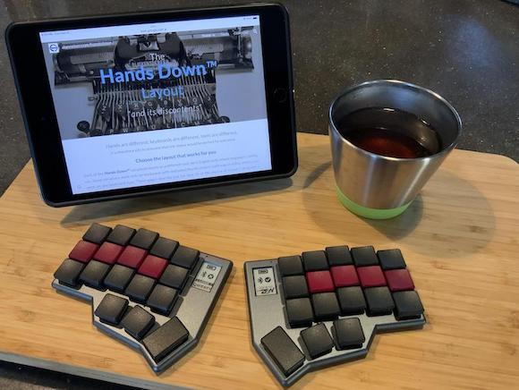
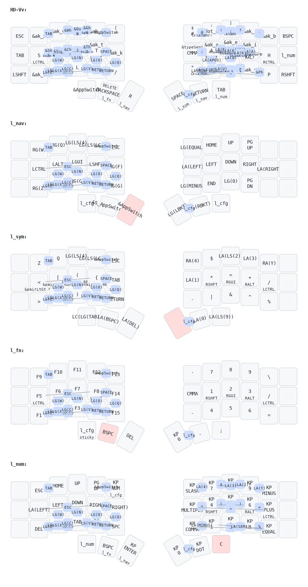

# [**Hands Down**](http://handsdownlayout.com) on 



My personal instance of [**Hands Down**](http://handsdownlayout.com) on a [Corne-ish *Zen*](https://www.reddit.com/r/ErgoMechKeyboards/comments/reyulp/my_new_zen/), including all my add-on features, (using only *very customized* ZMK behaviors), no custom code.

```
     ╭─────────────────────╮ ╭──────────────────────╮
ESC  │  X   W   M   G  "[  │ │  #$  .:  ']   J   B  │ BSP
TAB  │  S   C   N   T   K  | |  ,;   A   E   I   H  │ Tg(Num)
LSFT │  V   F   L   D   /* │ │  -+   U   O   Y   P  │ RSFT
     ╰──────╮  App BSP  R  │ │  SPC RET TAB  ╭──────╯
            ╰──────────────╯ ╰───────────────╯
```
[***Vibranium***](https://sites.google.com/alanreiser.com/handsdown/home/hands-down-neu#h.eyvjpfoqjy65) (a.k.a *Neu-vv*) is great with all the other [smart behaviors](https://sites.google.com/alanreiser.com/handsdown#h.8ngiif20qf4). Currently I have most of the *essential* combos (`Qu`,`Z`, `Undo`, `Cut`, `Copy`, `Paste`, etc.), *and* **`H` digraph combos** *to send* `TH`,`CH`,`WH`,`SH`,`GH`,`PH` *bigrams* (`PH` is a SFB on vv, which I always type with `PY` combo). There's a ZMK take on [***Adaptive Keys***](https://sites.google.com/alanreiser.com/handsdown#h.ps4itorhjiq9) (*using macros and sticky layers*) and [***Linger Keys***](https://sites.google.com/alanreiser.com/handsdown#h.w8doktr0rzce) (*using macros and hold-tap behaviors*). They behave a bit differently than in QMK, but are quite usable. Eventually I hope to deploy a properly coded solution to these features.

Templates for [***Neu***](https://sites.google.com/alanreiser.com/handsdown/home/hands-down-neu#h.ze4kq734zl5w) and [***Gold***](https://sites.google.com/alanreiser.com/handsdown/home/hands-down-neu#h.8i2msuo3butx) are in the works.


Currently building only for a Mac (*hard coded for gui instead of ctrl, and some Mac specific keycodes*), because I use this mainly with my iPads and phone when I'm on the road. My [***Semantic Keys***](https://sites.google.com/alanreiser.com/handsdown#h.7mehnxbqcx2s) feature for platform independence works on my QMK implementations, but isn't yet fully fleshed out and will require more invasive work for ZMK, so this too is for later.

 Below is a much simplified view of my zen keymap (*no adaptive or config layers, many combos not shown*).



Thanks to [jcmkk3](https://github.com/jcmkk3) for the idea to implement adaptives via sticky layers, and many others on the [**Hands Down** Discord](https://discord.gg/BC3fzb2E) for the endless creativity and support. Of course, huge thanks to [Pete Johanson](https://github.com/petejohanson) *and contributors* for ZMK, and to [Darryldh (lowprokb)](https://github.com/LOWPROKB) for the rather amazing [Corne-ish Zen](https://github.com/LOWPROKB/zmk-config-Corne-ish-Zen) board. Also thanks to [caksoylar](https://github.com/caksoylar) for the great keymap visualization tool, [keymap drawer](https://github.com/caksoylar/keymap-drawer) used to make the keymap images above.
