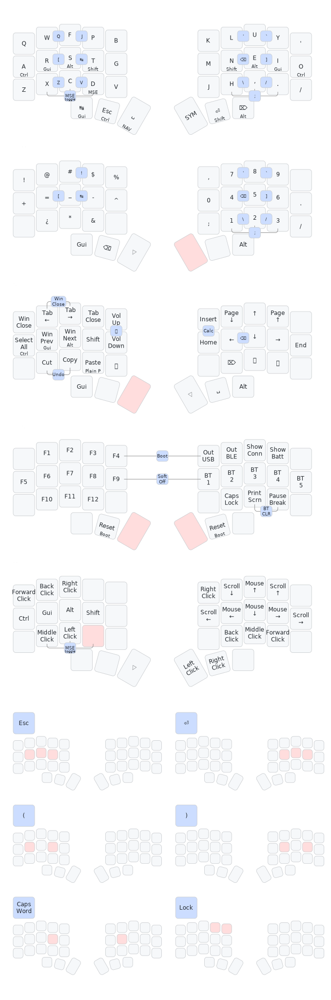

# zmk-config

## Keymap

This is a [ZMK](https://zmk.dev) config repo for my 30-36 key split keyboards, arranged in 3 rows of 5 columns with 2 or 3 thumb keys on each side.
The keymap is optimized to be usable with 30 keys, with dropped keys from inner index and pinky columns and two thumb keys each, like the [Hummingbird](https://github.com/PJE66/hummingbird) layout.
Currently these keyboards are:
- [Corne-ish Zen](https://lowprokb.ca/products/corne-ish-zen) (36 keys)
- A hand-wired [Rommana](https://github.com/AlaaSaadAbdo/Rommana) (30 keys)
- [Hypergolic (1.2 BM variant)](https://github.com/davidphilipbarr/hypergolic) (34 keys)

It mainly uses three non-base layers activated through two thumb keys, along with combos. It has <kbd>Ctrl</kbd>/<kbd>Shift</kbd> thumb hold-taps along with home row mods, which are also available on the left side of `NAV` layer.
`FUN` layer is implemented as a tri-layer, i.e. it is active when both `NAV` and `SYM` are active.

The default alpha layer is a modification of Colemak-DH and an alternative is the [Bird layout](https://github.com/jcmkk3/bird-layout) by @jcmkk3.

OS-dependent shortcuts are present on the `NAV` layer, e.g. for Windows:
- `Win Close`: <kbd>Alt</kbd><kbd>F4</kbdy>
- `Tab Next`: <kbd>Ctrl</kbd><kbd>Tab</kbd>
- `Tab Prev`: <kbd>Ctrl</kbd><kbd>Shift</kbd><kbd>Tab</kbd>
- `Tab Close`: <kbd>Ctrl</kbd><kbd>F4</kbd>
- `Desk Next`: <kbd>Ctrl</kbd><kbd>Gui</kbd><kbd>Right</kbd>
- `Desk Prev`: <kbd>Ctrl</kbd><kbd>Gui</kbd><kbd>Left</kbd>
- `Win Next`: <kbd>Alt</kbd><kbd>Tab</kbd> (hold Alt while layer active) using zmkfirmware/zmk#1366
- `Win Prev`: <kbd>Alt</kbd><kbd>Shift</kbd><kbd>Tab</kbd> (hold Alt while layer active)

Below representation was generated with [`keymap-drawer`](https://github.com/caksoylar/keymap-drawer) -- check out the automatically generated layouts using the [automated Github workflow](https://github.com/caksoylar/keymap-drawer/tree/main#setting-up-an-automated-drawing-workflow) for each keyboard in the [`keymap-drawer` folder](keymap-drawer/), which is always up to date with the config.

See my [QMK userspace](https://github.com/caksoylar/qmk_userspace/) for equivalent keymap definitions for QMK.

## ZMK customizations

I use a custom ZMK branch referenced in [west.yml](config/west.yml) which contains a few extras, namely [mouse keys](https://github.com/zmkfirmware/zmk/pull/778) used in the `MSE` layer, [global quick tap for combos](https://github.com/zmkfirmware/zmk/pull/1387), [swapper behavior](https://github.com/zmkfirmware/zmk/pull/1366) and [display improvements for the Corne-ish Zen](https://gist.github.com/caksoylar/c411313990978e1903c244f03039187a).
For a variant of my configuration tailored for stock ZMK, check out the [`stock` branch](https://github.com/caksoylar/zmk-config/tree/stock).

## Custom shields

This repo also contains shield definitions for a few keyboards using Pro Micro format daughterboards:
- [`choc_ergo`](https://keypcb.xyz/choc_ergo)
- [`hypergolic`](https://github.com/davidphilipbarr/hypergolic) -- you should probably use [the official Cradio shield](https://github.com/zmkfirmware/zmk/tree/main/app/boards/shields/cradio/) instead
- [`ffkb` v1](https://fingerpunch.xyz/product/faux-fox-keyboard/) with an OLED, building upon [sadekbaroudi's](https://github.com/sadekbaroudi/zmk-ffkb) and [NCKiser's](https://github.com/NCKiser/zmk-ffkb) definitions
- [`swweeep`](https://github.com/sadekbaroudi/sweep36) using [sadekbaroudi's](https://github.com/sadekbaroudi/zmk-swweeep) definition

## LED indicators widget

This repo also contains an indicator widget to be used with an RGB LED, like the user LEDs on a Xiao BLE.
Check out the [`rgbled_widget` shield](config/boards/shields/rgbled_widget/) which you can try by putting in your own config repo and adding the `rgbled_widget` in your `build.yaml`, like [this](build.yaml#L23).
